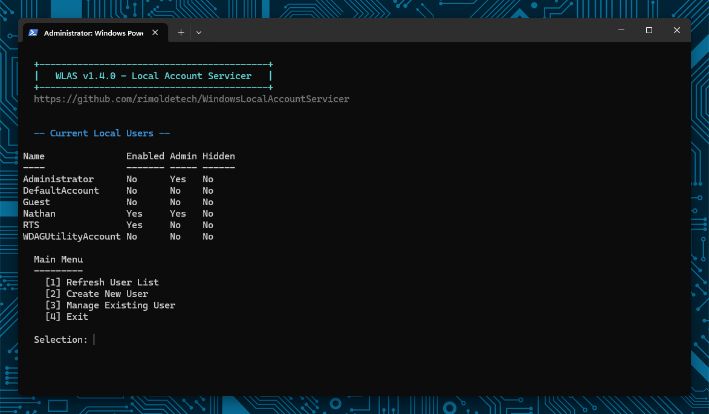

# Windows Local Account Servicer (WLAS)

A robust PowerShell script for servicing local Windows user accounts. Designed for use with [TacticalRMM](https://docs.tacticalrmm.com/) and similar RMM platforms, but equally useful interactively — run it without arguments to get a full text-based menu interface.

WLAS consolidates account creation, password management, enable/disable, Administrator promotion/demotion, lock screen visibility, and account info updates into a single script. Multiple actions can be combined in one invocation, and passwords are generated cryptographically at random when not provided.

---

## Screenshot



---

## Features

- **Interactive TUI** — menu-driven interface for use directly on a machine or in a basic remote session
- **Non-interactive / RMM mode** — fully argument-driven, no prompts, suitable for automated deployment
- **Multi-action support** — combine actions in a single run; they always execute in a safe logical order
- **Random password generation** — cryptographically secure, guarantees mixed character classes; used by default when no password is supplied
- **Lock screen management** — hide or show accounts on the Windows login screen via registry
- **Automatic registry cleanup** — deleting an account also removes any associated lock screen registry entry
- **Consistent output format** — `[OK]`, `[INFO]`, `[WARN]`, `[ERROR]` prefixes on all output for easy RMM log parsing

---

## Requirements

- Windows PowerShell 5.1 or later
- Must be run as a local Administrator
- Target machine must support the `Microsoft.PowerShell.LocalAccounts` module (included in Windows 10/11 and Server 2016+)

---

## Usage

### Interactive TUI

Run WLAS with no arguments to launch the menu interface.

```powershell
.\WLAS.ps1
```

### Non-Interactive (RMM / CLI)

```powershell
.\WLAS.ps1 -Username <string> -Action <action[,action,...]> [options]
```

### Help

```powershell
.\WLAS.ps1 -h
.\WLAS.ps1 -help
.\WLAS.ps1 --help
.\WLAS.ps1 /?
```

- `-h`, `-help`, `--help`, and `/?` display a brief inline summary of all actions and options.
---

## Parameters

| Parameter | Type | Required | Description |
|---|---|---|---|
| `-Username` | string | For most actions | Target local account name. Not required for `List`. When passed alone without `-Action`, displays account information. |
| `-Action` | string[] | Yes | One or more actions to perform (see below). Comma-separated or passed multiple times. |
| `-Password` | string | No | Plaintext password for `Create` or `ResetPassword`. Passed through as-is — no Base64 detection or decoding. Auto-generated if omitted. Cannot be combined with `-PasswordBase64`. |
| `-PasswordBase64` | string | No | Base64-encoded password. Always decoded — no heuristics applied. Useful in RMM contexts where special characters such as `&`, `%`, and `^` are interpreted by the shell before PowerShell receives them. Cannot be combined with `-Password`. |
| `-PasswordLength` | int | No | Length of the auto-generated password. Default: `20`. |
| `-FullName` | string | No | Display name for the account. Used with `Create` and `SetInfo`. |
| `-Description` | string | No | Account description. Used with `Create` and `SetInfo`. |
| `-Admin` | switch | No | When used with `Create`, adds the account to both the Users and Administrators groups. |
| `-NoPassword` | switch | No | When used with `Create`, creates the account with no password. When used with `ResetPassword`, removes the existing password. |
| `-ClearFullName` | switch | No | When used with `SetInfo`, clears the full name field to blank. |
| `-ClearDescription` | switch | No | When used with `SetInfo`, clears the description field to blank. |
| `-DeleteProfile` | switch | No | When used with `Delete`, also removes the user's profile folder and associated registry entries. The user must be fully signed out. |

---

## Actions

| Action | Description |
|---|---|
| `List` | List all local accounts with Enabled, Admin, Hidden, and description status. |
| `Create` | Create a new local user account. |
| `Delete` | Delete an account. Also removes any associated lock screen registry entry. Use `-DeleteProfile` to also remove the user's profile folder. Cannot be used against built-in accounts. |
| `Enable` | Enable a disabled account. |
| `Disable` | Disable an account. Cannot be used against built-in accounts. |
| `ResetPassword` | Reset the account password. Generates a random password if `-Password` is not provided. Use `-NoPassword` to remove the password entirely. |
| `SetInfo` | Update the full name and/or description of an existing account. Use `-ClearFullName` or `-ClearDescription` to blank those fields. |
| `Promote` | Add the account to the Administrators group. |
| `Demote` | Remove the account from the Administrators group. Ensures the account remains in the Users group. Cannot be used against built-in accounts. |
| `Hide` | Hide the account from the Windows lock screen. A sign-out or restart may be required. |
| `Show` | Show the account on the Windows lock screen. A sign-out or restart may be required. |

When multiple actions are specified, they always execute in this order regardless of how they are passed: `Create → Enable/Disable → ResetPassword → SetInfo → Promote/Demote → Hide/Show → Delete → List`

---

## Examples

**List all local accounts**
```powershell
.\WLAS.ps1 -Action List
```

**Show information for a specific account**
```powershell
.\WLAS.ps1 -Username jdoe
```

**Create a standard user with a random password**
```powershell
.\WLAS.ps1 -Username jdoe -Action Create -FullName "John Doe"
```

**Create an admin account with a specific password**
```powershell
.\WLAS.ps1 -Username svcadmin -Action Create -Password "P@ssw0rd!" -Admin
```

**Create an account with no password**
```powershell
.\WLAS.ps1 -Username jdoe -Action Create -NoPassword
```

**Create an admin account, hide from lock screen, and enable in one run**
```powershell
.\WLAS.ps1 -Username svcadmin -Action Create,Hide,Enable -Admin
```

**Reset a password (random) and hide from lock screen**
```powershell
.\WLAS.ps1 -Username jdoe -Action ResetPassword,Hide
```

**Remove a user's password**
```powershell
.\WLAS.ps1 -Username jdoe -Action ResetPassword -NoPassword
```

**Promote an existing account and enable it**
```powershell
.\WLAS.ps1 -Username jdoe -Action Promote,Enable
```

**Update full name and description**
```powershell
.\WLAS.ps1 -Username jdoe -Action SetInfo -FullName "John Doe" -Description "Finance dept"
```

**Clear a user's full name and set a new description**
```powershell
.\WLAS.ps1 -Username jdoe -Action SetInfo -ClearFullName -Description "Finance dept"
```

**Clear both full name and description**
```powershell
.\WLAS.ps1 -Username jdoe -Action SetInfo -ClearFullName -ClearDescription
```

**Create a user with a password containing special characters (Base64-encoded)**
```powershell
# Generate the encoded value first in any PowerShell session:
[Convert]::ToBase64String([System.Text.Encoding]::UTF8.GetBytes('P@ssw0rd!'))
# Then pass the output to the script:
.\WLAS.ps1 -Username jdoe -Action Create -PasswordBase64 <base64string>
```

**Disable an account**
```powershell
.\WLAS.ps1 -Username jdoe -Action Disable
```

**Delete an account**
```powershell
.\WLAS.ps1 -Username olduser -Action Delete
```

**Delete an account and remove its profile folder**
```powershell
.\WLAS.ps1 -Username olduser -Action Delete -DeleteProfile
```

---

## TacticalRMM Notes

This script is designed to work cleanly within TacticalRMM:

- All output uses `Write-Output` (not `Write-Host`) for reliable stdout capture in RMM logs
- Exit codes: `0` on success, `1` on error
- The `[OK]`, `[INFO]`, `[WARN]`, and `[ERROR]` output prefixes are consistent across all actions and suitable for log parsing or alert conditions
- Pass arguments directly via the script arguments field; no modification to the script is needed per-deployment
- For passwords containing special characters (`&`, `%`, `^` etc.), use `-PasswordBase64` to avoid shell interpretation issues. Generate the encoded value once in any PowerShell session and store it as a script argument or custom field in Tactical.

---

## Notes

- Lock screen `Hide`/`Show` changes may require a sign-out or restart to take effect, depending on the environment
- `Demote` always ensures the account remains in the Users group after removal from Administrators, consistent with Windows built-in behaviour
- Deleting an account automatically removes its lock screen registry entry if one exists, preventing it from being silently inherited by a future account with the same username
- `-DeleteProfile` uses `Win32_UserProfile` to remove the user's profile folder and registry hive the way Windows intends — the same mechanism behind the Delete button in System Properties → User Profiles. The user must be fully signed out; if the profile is loaded the operation will fail cleanly without deleting the account. There is at least one edge case where the user is removed from the registry hive properly but their profile folder remains on disk; In this case, the script will warn of this outcome. Accounts that were never signed into have no registered profile and this is handled gracefully.
- Passing `-Username` without `-Action` displays a summary of that account rather than launching the TUI, making it safe to use in RMM contexts
- All accounts are created with **Password Never Expires** enabled. This applies to both password and no-password accounts. As Windows enforces mutual exclusivity between this and the must-change-password flag, the latter is always effectively off
- The random password generator uses `RandomNumberGenerator` (compatible with both PowerShell 5.1 and 7+) and guarantees at least one lowercase letter, uppercase letter, digit, and special character in every generated password
- `Delete`, `Disable`, and `Demote` are blocked against Windows built-in accounts (Administrator, Guest, DefaultAccount, WDAGUtilityAccount) regardless of whether they have been renamed. Detection is SID-based. This is a safety net against accidental lockout, particularly in RMM deployments
- `-Password` is always treated as plaintext. Use `-PasswordBase64` when the password contains special characters that would be interpreted by the shell. Only one of the two may be specified per invocation

---

### Password Length Limit

Windows local account passwords are capped at **127 characters** by the NTLM authentication protocol. `Set-LocalUser` accepts longer passwords without error, but Windows will silently reject them at login.

WLAS enforces this limit at runtime and will exit with an error if a supplied password exceeds 127 characters. This includes the built-in random password generator.

---

## Contributing

Contributions, bug reports, and feature requests are welcome. Please open an issue before submitting a pull request for anything beyond a minor fix so we can discuss the approach first.

---

## License

[MIT](LICENSE)
